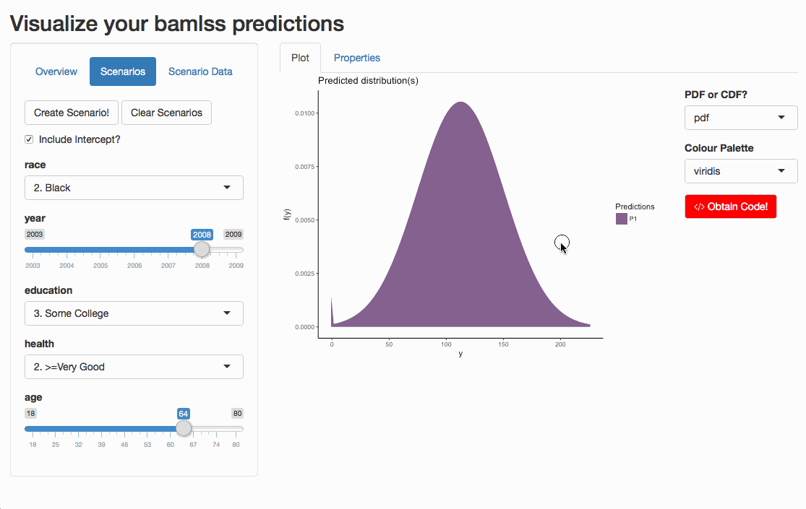

<!-- README.md is generated from README.Rmd. Please edit that file -->
bamlss.vis
==========

### What is `bamlss.vis`?

`bamlss.vis` is built upon the R package `bamlss` ([CRAN Link](https://cran.r-project.org/web/packages/bamlss/index.html)), which fits Bayesian Additive Models for Location, Scale and Shape. `bamlss.vis` requires a fitted `bamlss` object to achieve two goals:

1.  See and compare the expected distribution for chosen sets of covariates
2.  View the direct relationship between moments of the response distribution and a chosen explanatory variable, given a set of covariates.

The implementation is an interactive application using the Shiny framework.

### Install

`bamlss.vis` is not on CRAN, but only on GitHub at the moment. Run the following code to install the package and all its extensions. The following code also installs the latest version of `bamlss`, which is not on CRAN yet.

### Show-Case

Let's show an example using the `Wage` dataset, taken from the ISLR R package. It depicts the wage of 3000 male workers in the Mid-Atlantic region of the US, related to a couple of socio-economic variables.

First, let's fit a bamlss using the censored normal distribution (Wages cannot be negative):

Both parameters of the modeled wage distribution are now modeled as being dependent on the socio-economic variables.

#### Starting the application

The app can be started as an RStudio Add-In or running `bamlss.vis::vis()`. Afterwards, select the fitted model like so:

After the model was selected, you can head to the "Scenarios" tab.

#### Expected Distribution

At the Scenarios tab, you can choose specific observations of explanatory variables for which to predict the distribution. In this case, we select socioeconomic variables and get the expected income distribution for this combination:

We can further change the combinations to add a new "scenario" for comparing different covariate combinations:

#### Influence of Covariates

Furthermore, we can easily view the "influence" of a covariate on the expected income distribution. For this, head to the "Properties" tab:

#### Obtaining Code

All plots which were created can be reproduced with the code that appears when you press "Obtain Code":

