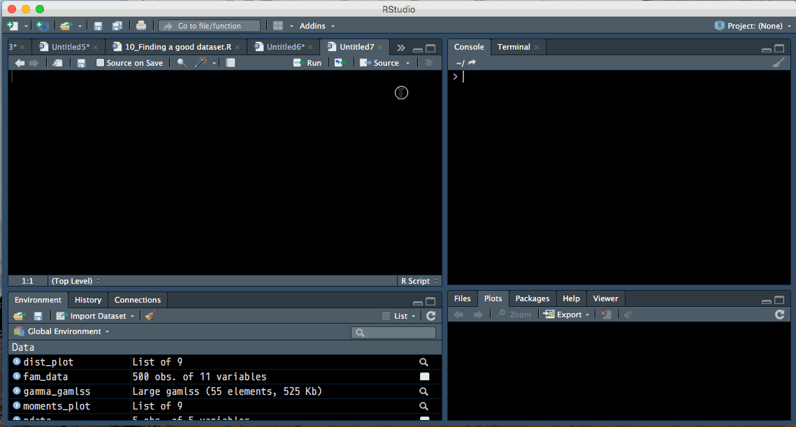
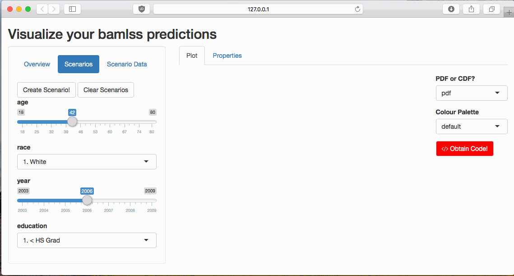
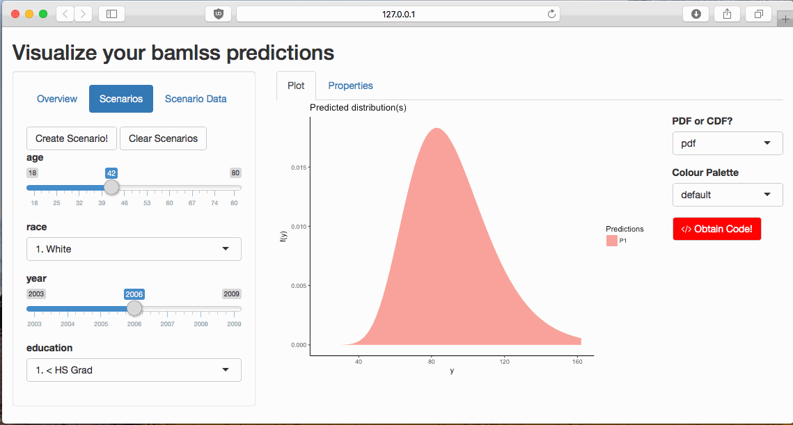
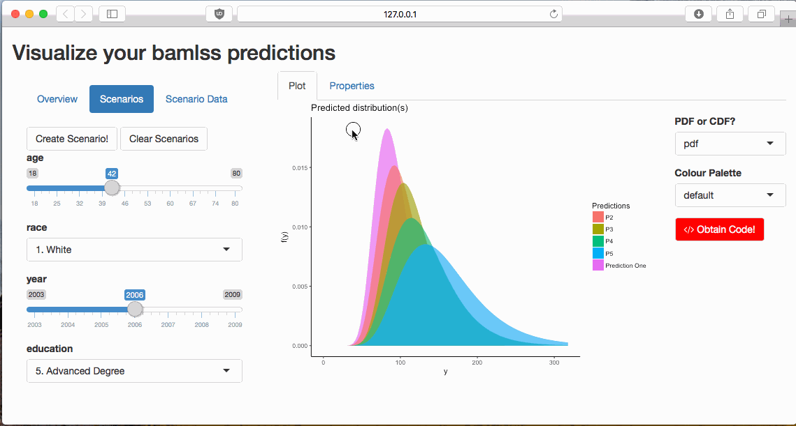
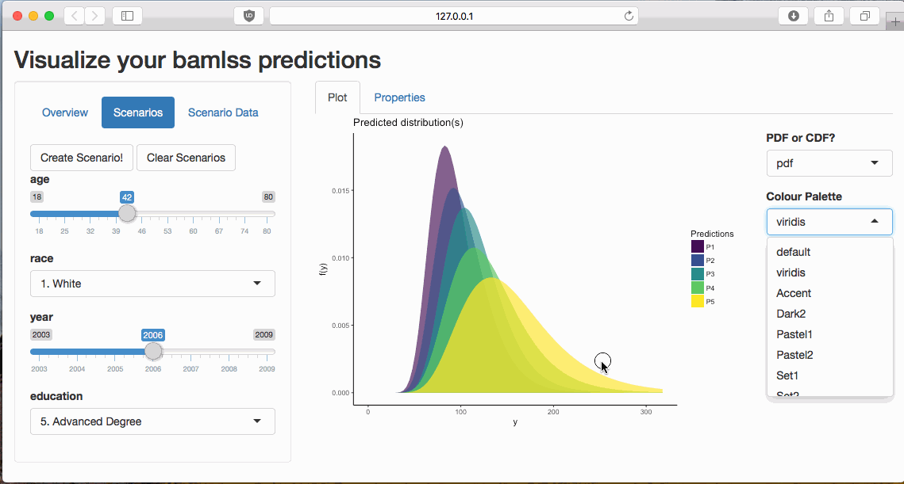

<!-- README.md is generated from README.Rmd. Please edit that file -->
distreg.vis
===========

[](https://travis-ci.org/Stan125/distreg.vis)

### What is `distreg.vis`?

`distreg.vis` is built upon the R package `bamlss` ([CRAN
Link](https://cran.r-project.org/web/packages/bamlss/index.html)) and
`gamlss` ([CRAN
Link](https://cran.r-project.org/web/packages/gamlss/index.html)), which
fits distributional regression models. `distreg.vis` requires a fitted
`bamlss` or `gamlss` object to achieve two goals:

1.  See and compare the expected distribution for chosen sets of
    covariates
2.  View the direct relationship between moments of the response
    distribution and a chosen explanatory variable, given a set of
    covariates.

The implementation is an interactive application using the Shiny
framework.

### Install

`distreg.vis` is not on CRAN, but only on GitHub at the moment. Run the
following code to install the package and all its extensions. The code
also installs new versions for `gamlss.dist` and `bamlss`, which are not
on CRAN yet but include necessary functions.

``` r
if (!require(devtools))
  install.packages("devtools")
library(devtools)
install_github("Stan125/gamlss.dist")
install_github("rforge/bayesr/pkg/bamlss")
install_github("Stan125/distreg.vis")
```

### Supported distributions

At the moment, the following distributions are fully supported:

``` r
dists %>%
  filter(moment_funs) %>%
  dplyr::select(dist_name, class)
#>      dist_name  class
#> 1         EGB2 gamlss
#> 2       exGAUS gamlss
#> 3           GT gamlss
#> 4           GU gamlss
#> 5          JSU gamlss
#> 6         JSUo gamlss
#> 7           LO gamlss
#> 8        LOGNO gamlss
#> 9           NO gamlss
#> 10         NO2 gamlss
#> 11         NOF gamlss
#> 12          PE gamlss
#> 13         PE2 gamlss
#> 14          PO gamlss
#> 15          RG gamlss
#> 16         SN1 gamlss
#> 17         SN2 gamlss
#> 18         SST gamlss
#> 19          TF gamlss
#> 20         TF2 gamlss
#> 21        beta bamlss
#> 22    binomial bamlss
#> 23       cnorm bamlss
#> 24       gamma bamlss
#> 25    gaussian bamlss
#> 26   gaussian2 bamlss
#> 27      glogis bamlss
#> 28     gpareto bamlss
#> 29 multinomial bamlss
#> 30     poisson bamlss
```

The rest of the distributions are mostly supported, but only in
displaying their predicted distributions, and not their moments.

### Show-Case

Let’s show an example using the `Wage` dataset, taken from the ISLR R
package. It depicts the wage of 3000 male workers in the Mid-Atlantic
region of the US, related to a couple of socio-economic variables.

First, let’s fit a bamlss using the log normal distribution (Wages
cannot be negative):

``` r
library(gamlss)
Wage <- ISLR::Wage
wage_model <- gamlss(wage ~ ps(age) + race + year + education,
                     ~ ps(age) + race + year + education,
                     data = Wage, family = LOGNO())
```

Both parameters of the modeled wage distribution are now modeled as
being dependent on the socio-economic variables.

#### Starting the application

The app can be started as an RStudio Add-In or running
`distreg.vis::vis()`. Afterwards, select the fitted model like so:
<p align="center">

</p>
After the model was selected, you can head to the “Scenarios” tab.

#### Expected Distribution

At the Scenarios tab, you can choose specific observations of
explanatory variables for which to predict the distribution. In this
case, we select socioeconomic variables and get the expected income
distribution for this combination:

<p align="center">

</p>
The real power of `distreg.vis` is visible when we add multiple
“scenarios” for comparing different covariate combinations:

<p align="center">

</p>
#### Influence of Covariates

Furthermore, we can easily view the “influence” of a covariate on the
expected income distribution. For this, head to the “Properties” tab:

<p align="center">

</p>
#### Obtaining Code

All plots which were created can be reproduced with the code that
appears when you press “Obtain Code”:
<p align="center">

</p>
